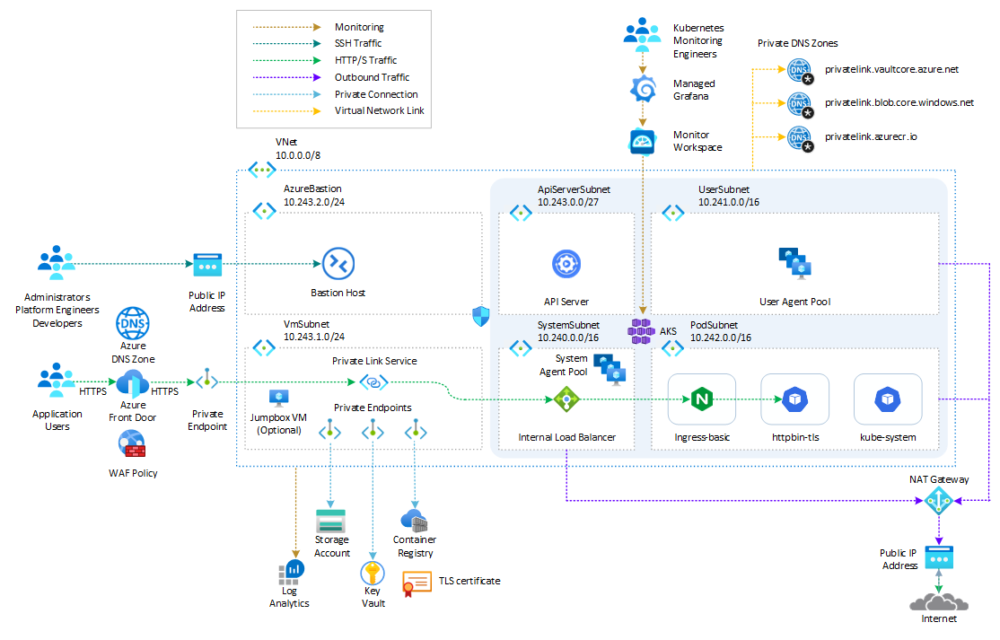
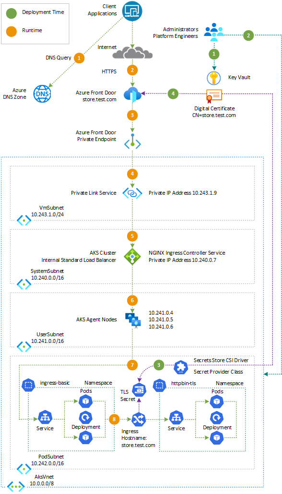
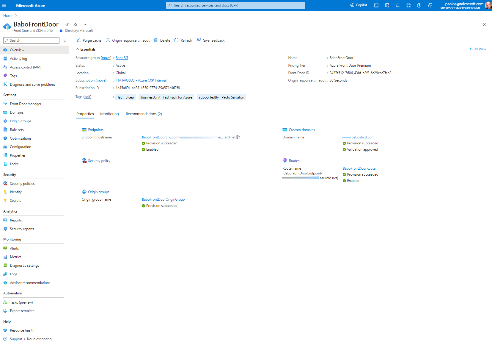
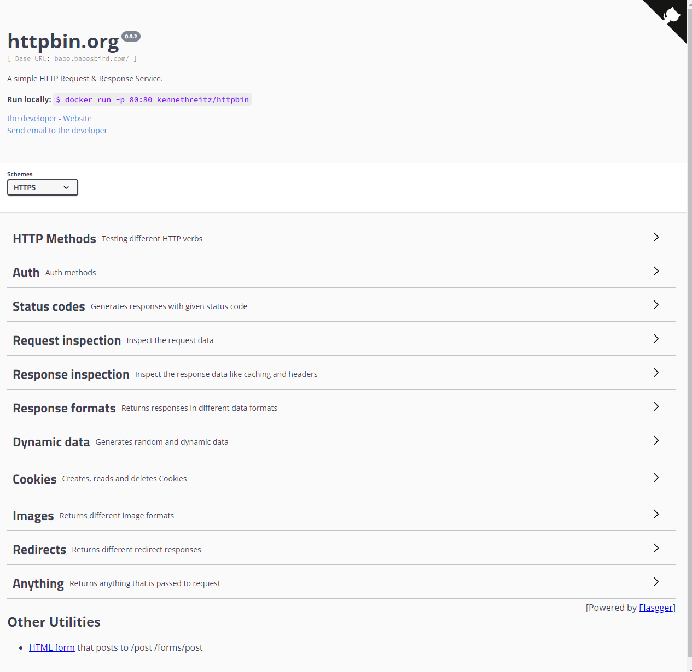

# End-to-end TLS with AKS, Azure Front Door, Azure Private Link Service, and NGINX Ingress Controller

To ensure your security and compliance requirements are met, [Azure Front Door](https://learn.microsoft.com/en-us/azure/frontdoor/front-door-overview) offers comprehensive end-to-end TLS encryption. For more information, see [End-to-end TLS with Azure Front Door](https://learn.microsoft.com/en-us/azure/frontdoor/end-to-end-tls?pivots=front-door-standard-premium) support. With Front Door's TLS/SSL offload capability, the TLS connection is terminated and the incoming traffic is decrypted at the Front Door. The traffic is then re-encrypted before being forwarded to the origin, that in this project is represented by a web application hosted in an [Azure Kubernetes Service](https://docs.microsoft.com/en-us/azure/aks/intro-kubernetes) cluster. The sample application is exposed via a managed or unmanaged [NGINX Ingress Controller](https://docs.nginx.com/nginx-ingress-controller/intro/overview/):

- `Managed`: a managed NGINX ingress controller is deployed using the [application routing add-on for AKS](https://learn.microsoft.com/en-us/azure/aks/app-routing). The deployment script configures the managed NGINX ingress controller to use a private IP address as a frontend IP configuration of the `kubernetes-internal` internal load balancer. For more information, see [Configure NGINX ingress controller to support Azure private DNS zone with application routing add-on](https://learn.microsoft.com/en-us/azure/aks/create-nginx-ingress-private-controller).
- `Unmanaged`: an unmanaged NGINX ingress controller is deployed via Helm. The deployment script configures the unmanaged NGINX ingress controller to use a private IP address as a frontend IP configuration of the `kubernetes-internal` internal load balancer. For more information, see [Create an ingress controller using an internal IP address](https://learn.microsoft.com/en-us/azure/aks/ingress-basic?tabs=azure-cli#create-an-ingress-controller-using-an-internal-ip-address).

To enhance security, HTTPS is configured as the forwarding protocol on Azure Front Door when connecting to the AKS-hosted workload configured as a origin. This practice ensures that end-to-end TLS encryption is enforced for the entire request process, from the client to the origin.

[Azure Front Door Premium](https://learn.microsoft.com/en-us/azure/frontdoor/front-door-overview) can connect to a backend application via [Azure Private Link Service (PLS)](https://learn.microsoft.com/en-us/azure/private-link/private-link-service-overview). For more information, see [Secure your Origin with Private Link in Azure Front Door Premium](https://learn.microsoft.com/en-us/azure/frontdoor/private-link). If you deploy a private origin using [Azure Front Door Premium](https://learn.microsoft.com/en-us/azure/frontdoor/front-door-overview) and the [Azure Private Link Service (PLS)](https://learn.microsoft.com/en-us/azure/private-link/private-link-service-overview), TLS/SSL offload is fully supported.

This article demonstrates how to set up end-to-end TLS encryption using Azure Front Door Premium and Azure Kubernetes Service (AKS). In addition, it shows how to use [Azure Front Door Premium](https://learn.microsoft.com/en-us/azure/frontdoor/front-door-overview), [Azure Web Application Firewall](https://learn.microsoft.com/en-us/azure/web-application-firewall/afds/afds-overview), and [Azure Private Link Service (PLS)](https://learn.microsoft.com/en-us/azure/private-link/private-link-service-overview) to securely expose and protect a workload running in [Azure Kubernetes Service(AKS)](https://docs.microsoft.com/en-us/azure/aks/intro-kubernetes). The sample application is exposed via the [NGINX Ingress Controller](https://docs.nginx.com/nginx-ingress-controller/intro/overview/) configured to use a private IP address as a frontend IP configuration of the `kubernetes-internal` internal load balancer. For more information, see [Create an ingress controller using an internal IP address](https://learn.microsoft.com/en-us/azure/aks/ingress-basic?tabs=azure-cli#create-an-ingress-controller-using-an-internal-ip-address).

This sample also shows how to deploy an [Azure Kubernetes Service](https://docs.microsoft.com/en-us/azure/aks/intro-kubernetes) cluster with the [API Server VNET Integration](https://learn.microsoft.com/en-us/azure/aks/api-server-vnet-integration) and how to use an [Azure NAT Gateway](https://learn.microsoft.com/en-us/azure/virtual-network/nat-gateway/nat-overview) to manage outbound connections initiated by AKS-hosted workloads. AKS clusters with API Server VNET integration provide a series of advantages, for example, they can have public network access or private cluster mode enabled or disabled without redeploying the cluster. For more information, see [Create an Azure Kubernetes Service cluster with API Server VNet Integration](https://learn.microsoft.com/en-us/azure/aks/api-server-vnet-integration).

If it is not necessary to implement end-to-end TLS and if the Front Door route can be set up to utilize HTTP instead of HTTPS for calling the downstream AKS-hosted workload, you may refer to the following resource: [How to expose NGINX Ingress Controller via Azure Front Door and Azure Private Link Service](https://techcommunity.microsoft.com/t5/fasttrack-for-azure/how-to-expose-nginx-ingress-controller-via-azure-front-door-and/ba-p/3767535).

## Prerequisites

- An active [Azure subscription](https://docs.microsoft.com/en-us/azure/guides/developer/azure-developer-guide#understanding-accounts-subscriptions-and-billing). If you don't have one, create a [free Azure account](https://azure.microsoft.com/free/) before you begin.
- [Visual Studio Code](https://code.visualstudio.com/) installed on one of the [supported platforms](https://code.visualstudio.com/docs/supporting/requirements#_platforms) along with the [Bicep extension](https://marketplace.visualstudio.com/items?itemName=ms-azuretools.vscode-bicep).
- Azure CLI version 2.58.0 or later installed. to install or upgrade, see [Install Azure CLI](https://learn.microsoft.com/en-us/cli/azure/install-azure-cli).
- An existing [Azure Key Vault](https://learn.microsoft.com/en-us/azure/key-vault/general/overview) resource with a valid TLS certificate for the sample web application.
- An existing [Azure DNS Zone](https://learn.microsoft.com/en-us/azure/dns/dns-zones-records) for the name resolution of the [Azure Front Door custom domain](https://learn.microsoft.com/en-us/azure/frontdoor/front-door-custom-domain) via a [CNAME record](https://en.wikipedia.org/wiki/CNAME_record).

## Architecture

This sample provides a set of Bicep modules to deploy and configure an [Azure Front Door Premium](https://learn.microsoft.com/en-us/azure/frontdoor/front-door-overview) with an [WAF Policy](https://learn.microsoft.com/en-us/azure/web-application-firewall/afds/afds-overview) as global load balancer in front of a public or a private AKS cluster with [API Server VNET Integration](https://learn.microsoft.com/en-us/azure/aks/api-server-vnet-integration). You can can either configure your AKS cluster to use [Azure CNI](https://learn.microsoft.com/en-us/azure/aks/configure-azure-cni) with [Dynamic IP Allocation](https://learn.microsoft.com/en-us/azure/aks/configure-azure-cni#dynamic-allocation-of-ips-and-enhanced-subnet-support) or [Azure CNI Overlay](https://learn.microsoft.com/en-us/azure/aks/azure-cni-overlay?tabs=kubectl) networking. In addition, the deployment configures the AKS cluster with the [Azure Key Vault provider for Secrets Store CSI Driver](https://learn.microsoft.com/en-us/azure/aks/csi-secrets-store-driver) that allows for the integration of an [Azure Key Vault](https://learn.microsoft.com/en-us/azure/key-vault/general/overview) as a secret store with an Azure Kubernetes Service (AKS) cluster via a [CSI volume](https://kubernetes-csi.github.io/docs/).

The following diagram shows the architecture and network topology deployed by the project when the AKS cluster is configured to use [Azure CNI](https://learn.microsoft.com/en-us/azure/aks/configure-azure-cni) with [Dynamic IP Allocation](https://learn.microsoft.com/en-us/azure/aks/configure-azure-cni#dynamic-allocation-of-ips-and-enhanced-subnet-support):



A [Deployment Script](https://learn.microsoft.com/en-us/azure/azure-resource-manager/bicep/deployment-script-bicep) is used to optionally install the [NGINX Ingress Controller](https://docs.nginx.com/nginx-ingress-controller/intro/overview/), configured to use a private IP address as frontend IP configuration of the `kubernetes-internal` internal load balancer, via Helm and a sample [httpbin](https://httpbin.org/) web application via YAML manifests. The script defines a `SecretProviderClass` to read the TLS certificate from the source Azure Key Vault and creates a Kubernetes `secret`. The `deployment` and `ingress` objects are configured to use the certificate contained in the Kubernetes secret.

The [Origin](https://learn.microsoft.com/en-us/azure/frontdoor/origin?pivots=front-door-standard-premium) child resource of the [Azure Front Door Premium](https://learn.microsoft.com/en-us/azure/frontdoor/front-door-overview) global load balancer is configured to call the sample application using the HTTP forwarding protocol via the [Azure Private Link Service](https://learn.microsoft.com/en-us/azure/private-link/private-link-service-overview), the AKS the `kubernetes-internal` internal load balancer, and the [NGINX Ingress Controller](https://docs.nginx.com/nginx-ingress-controller/intro/overview/).  

Bicep modules are parametric, so you can choose any network plugin:

- [Azure CNI with static IP allocation](https://learn.microsoft.com/en-us/azure/aks/configure-azure-cni)
- [Azure CNI with dynamic IP allocation](https://learn.microsoft.com/en-us/azure/aks/configure-azure-cni-dynamic-ip-allocation)
- [Azure CNI Powered by Cilium](https://learn.microsoft.com/en-us/azure/aks/azure-cni-powered-by-cilium)
- [Azure CNI Overlay](https://learn.microsoft.com/en-us/azure/aks/azure-cni-overlay)
- [BYO CNI](https://learn.microsoft.com/en-us/azure/aks/use-byo-cni?tabs=azure-cli)
- [Kubenet](https://learn.microsoft.com/en-us/azure/aks/configure-kubenet)

> **NOTE**  
> The sample was tested only with [Azure CNI](https://learn.microsoft.com/en-us/azure/aks/configure-azure-cni) and [Azure CNI Overlay](https://learn.microsoft.com/en-us/azure/aks/azure-cni-overlay)

In addition, the project shows how to deploy an [Azure Kubernetes Service](https://docs.microsoft.com/en-us/azure/aks/intro-kubernetes) cluster with the following extensions and features:

- [Istio-based service mesh add-on for Azure Kubernetes Service](https://learn.microsoft.com/en-us/azure/aks/istio-about) provides an officially supported and tested [Istio](https://istio.io/v1.1/docs/concepts/what-is-istio/) integration for Azure Kubernetes Service (AKS).
- [API Server VNET Integration](https://learn.microsoft.com/en-us/azure/aks/api-server-vnet-integration) allows you to enable network communication between the API server and the cluster nodes without requiring a private link or tunnel. AKS clusters with API Server VNET integration provide a series of advantages, for example, they can have public network access or private cluster mode enabled or disabled without redeploying the cluster. For more information, see [Create an Azure Kubernetes Service cluster with API Server VNet Integration](https://learn.microsoft.com/en-us/azure/aks/api-server-vnet-integration).
- [Azure NAT Gateway](https://learn.microsoft.com/en-us/azure/virtual-network/nat-gateway/nat-overview) to manage outbound connections initiated by AKS-hosted workloads.
- [Event-driven Autoscaling (KEDA) add-on](https://learn.microsoft.com/en-us/azure/aks/keda-about) is a single-purpose and lightweight component that strives to make application autoscaling simple and is a CNCF Incubation project.
- [Dapr extension for Azure Kubernetes Service (AKS)](https://learn.microsoft.com/en-us/azure/aks/dapr) allows you to install [Dapr](https://dapr.io/), a portable, event-driven runtime that simplifies building resilient, stateless, and stateful applications that run on the cloud and edge and embrace the diversity of languages and developer frameworks. With its sidecar architecture, Dapr helps you tackle the challenges that come with building microservices and keeps your code platform agnostic.
- [Flux V2 extension](https://learn.microsoft.com/en-us/azure/azure-arc/kubernetes/tutorial-use-gitops-flux2?tabs=azure-cli) allows to deploy workloads to an Azure Kubernetes Service (AKS) cluster via [GitOps](https://www.weave.works/technologies/gitops/). For more information, see [GitOps Flux v2 configurations with AKS and Azure Arc-enabled Kubernetes](https://learn.microsoft.com/en-us/azure/azure-arc/kubernetes/conceptual-gitops-flux2)
- [Vertical Pod Autoscaling](https://learn.microsoft.com/en-us/azure/aks/vertical-pod-autoscaler) allows you to automatically sets resource requests and limits on containers per workload based on past usage. VPA makes certain pods are scheduled onto nodes that have the required CPU and memory resources. For more information, see [Kubernetes Vertical Pod Autoscaling](https://itnext.io/k8s-vertical-pod-autoscaling-fd9e602cbf81).
- [Azure Key Vault Provider for Secrets Store CSI Driver](https://learn.microsoft.com/en-us/azure/aks/csi-secrets-store-identity-access) provides a variety of methods of identity-based access to your [Azure Key Vault](https://learn.microsoft.com/en-us/azure/key-vault/general/overview).
- [Image Cleaner](https://learn.microsoft.com/en-us/azure/aks/image-cleaner?tabs=azure-cli) to clean up stale images on your Azure Kubernetes Service cluster.
- [Azure Kubernetes Service (AKS) Network Observability](https://learn.microsoft.com/en-us/azure/aks/network-observability-overview) is an important part of maintaining a healthy and performant Kubernetes cluster. By collecting and analyzing data about network traffic, you can gain insights into how your cluster is operating and identify potential problems before they cause outages or performance degradation.
- [Managed NGINX ingress with the application routing add-on](https://learn.microsoft.com/en-us/azure/aks/app-routing).

In a production environment, we strongly recommend deploying a [private AKS cluster](https://docs.microsoft.com/en-us/azure/aks/private-clusters) with [Uptime SLA](https://docs.microsoft.com/en-us/azure/aks/uptime-sla). For more information, see [private AKS cluster with a Public DNS address](https://docs.microsoft.com/en-us/azure/aks/private-clusters#create-a-private-aks-cluster-with-a-public-dns-address). Alternatively, you can deploy a public AKS cluster and secure access to the API server using [authorized IP address ranges](https://learn.microsoft.com/en-us/azure/aks/api-server-authorized-ip-ranges).

The Bicep modules deploy or use the following Azure resources:

- [Microsoft.ContainerService/managedClusters](https://learn.microsoft.com/en-us/azure/templates/microsoft.containerservice/managedclusters?pivots=deployment-language-bicep): A public or private [Azure Kubernetes Service(AKS)](https://docs.microsoft.com/en-us/azure/aks/intro-kubernetes) cluster composed of the following node pools:
  - A `system` node pool in a dedicated subnet. The default node pool hosts only critical system pods and services. The worker nodes have node taint which prevents application pods from beings scheduled on this node pool.
  - A `user` node pool hosting user workloads and artifacts in a dedicated subnet.
- [Microsoft.Authorization/roleDefinitions](https://learn.microsoft.com/en-us/azure/templates/microsoft.authorization/roleassignments?pivots=deployment-language-bicep): the Bicep modules create the following role assignments:
  - a `Grafana Admin` role assignment on the Azure Managed Grafana for the Microsoft Entra ID user whose objectID is defined in the `userId` parameter. The `Grafana Admin` role provides full control of the instance including managing role assignments, viewing, editing, and configuring data sources. For more information, see [How to share access to Azure Managed Grafana](https://learn.microsoft.com/en-us/azure/managed-grafana/how-to-share-grafana-workspace?tabs=azure-portal).
  - a `Key Vault Administrator` role assignment on the existing Azure Key Vault resource which contains the TLS certificate for the user-defined managed identity used by the [Azure Key Vault provider for Secrets Store CSI Driver](https://learn.microsoft.com/en-us/azure/aks/csi-secrets-store-driver). This assignment is necessary to let the CSI driver read the certificate from the source Key Vault.
- [Microsoft.Cdn/profiles](https://learn.microsoft.com/en-us/azure/templates/microsoft.cdn/profiles?pivots=deployment-language-bicep): an [Azure Front Door Premium](https://learn.microsoft.com/en-us/azure/frontdoor/front-door-overview) resource used to expose the AKS-hosted sample application via [Azure Private Link Service](https://learn.microsoft.com/en-us/azure/private-link/private-link-service-overview) and [NGINX Ingress Controller](https://docs.nginx.com/nginx-ingress-controller/intro/overview/). The Bicep module creates the following child resources to expose the workload:
  - [Microsoft.Cdn/profiles/originGroups](https://learn.microsoft.com/en-us/azure/templates/microsoft.cdn/profiles/origingroups?pivots=deployment-language-bicep): an [Origin Group](https://learn.microsoft.com/en-us/azure/frontdoor/origin?pivots=front-door-standard-premium#origin-group) in [Azure Front Door](https://learn.microsoft.com/en-us/azure/frontdoor/front-door-overview) refers to a set of [Origins](https://learn.microsoft.com/en-us/azure/frontdoor/origin?pivots=front-door-standard-premium#origin) that receives similar traffic for their application. You can define the Origin Group as a logical grouping of your application instances across the world that receives the same traffic and responds with an expected behavior. These Origins can be deployed across different regions or within the same region. All origins can be deployed in an Active/Active or Active/Passive configuration.
  - [Microsoft.Cdn/profiles/originGroups/origins](https://learn.microsoft.com/en-us/azure/templates/microsoft.cdn/profiles/origingroups/origins?pivots=deployment-language-bicep): an [Origin](https://learn.microsoft.com/en-us/azure/frontdoor/origin?pivots=front-door-standard-premium#origin) refers to the application deployment exposed via [Azure Front Door](https://learn.microsoft.com/en-us/azure/frontdoor/front-door-overview). An Origin defines properties of the underlying backend application like its type, weight, priority, host header, and more. In this sample, the [Origin](https://learn.microsoft.com/en-us/azure/frontdoor/origin?pivots=front-door-standard-premium#origin) is configured to call the [httpbin](https://httpbin.org/) web application via an [Azure Private Link Service](https://learn.microsoft.com/en-us/azure/private-link/private-link-service-overview).
  - [Microsoft.Cdn/profiles/afdEndpoints](https://learn.microsoft.com/en-us/azure/templates/microsoft.cdn/profiles/afdendpoints?pivots=deployment-language-bicep): in [Azure Front Door Standard/Premium](https://learn.microsoft.com/en-us/azure/frontdoor/front-door-overview), an endpoint is a logical grouping of one or more routes that are associated with domain names. Each endpoint is assigned a domain name by Front Door, and you can associate your own custom domains by using routes.
  - [Microsoft.Cdn/profiles/secrets](https://learn.microsoft.com/en-us/azure/templates/microsoft.cdn/profiles/secrets?pivots=deployment-language-bicep): this resource is used to store and manage the TLS certificate from Azure Key Vault. This certificate is used by the custom domain.
  - [Microsoft.Cdn/profiles/customDomains](https://learn.microsoft.com/en-us/azure/templates/microsoft.cdn/profiles/customdomains?pivots=deployment-language-bicep): this resource allows you to configure and manage a custom domain name for the Front Door endpoint. The custom domain is configured to use the Front Door secret that contains the TLS certificate.
  - [Microsoft.Cdn/profiles/securityPolicies](https://learn.microsoft.com/en-us/azure/templates/microsoft.cdn/profiles/securitypolicies?pivots=deployment-language-bicep): a security policy associates a WAF policy to a list of domains and paths. For more information, see [Security and Azure Front Door](https://learn.microsoft.com/en-us/azure/architecture/framework/services/networking/azure-front-door/security).
  - [Microsoft.Network/FrontDoorWebApplicationFirewallPolicies](https://learn.microsoft.com/en-us/azure/templates/microsoft.network/2019-03-01/frontdoorwebapplicationfirewallpolicies?pivots=deployment-language-bicep): [Azure Web Application Firewall (WAF)](https://learn.microsoft.com/en-us/azure/web-application-firewall/afds/afds-overview) on [Azure Front Door](https://learn.microsoft.com/en-us/azure/frontdoor/front-door-overview) provides centralized protection for your web applications. WAF defends your web services against common exploits and vulnerabilities. It keeps your service highly available for your users and helps you meet compliance requirements. You can configure a WAF policy and associate that policy to one or more Front Door front-ends for protection. The WAF policy deployed by this sample consists of three types of security rules:
    - [Custom rules](https://learn.microsoft.com/en-us/azure/web-application-firewall/afds/afds-overview#custom-authored-rules) are used to block incoming requests based on the content of the payload, querystring, HTTP request method, IP address of the caller, and more. This sample add a couple of customer rules to block calls coming from a given IP range or calls that contain the word `blockme` in the querystring.
    - [OWASP](https://owasp.org/) [Azure-managed rule sets](https://learn.microsoft.com/en-us/azure/web-application-firewall/afds/afds-overview#azure-managed-rule-sets) provide an easy way to deploy protection against a common set of security threats like SQL injection or cross-site scripting.
    - [Bot protection rule set](https://learn.microsoft.com/en-us/azure/web-application-firewall/afds/afds-overview#bot-protection-rule-set) can be used to take custom actions on requests from known bot categories.
- [Microsoft.Network/dnsZones](https://learn.microsoft.com/en-us/azure/templates/microsoft.network/dnszones?pivots=deployment-language-bicep): this resource references an existing Azure DNS zone used for the name resolution of the Azure Front Door custom domain. You can use Azure DNS to host your DNS domain and manage your DNS records.
  - [Microsoft.Network/dnsZones/CNAME](https://learn.microsoft.com/en-us/azure/templates/microsoft.network/dnszones/cname?pivots=deployment-language-bicep): this CNAME record is used to create an alias or pointer from one domain name to another. With this resource, you can configure a [CNAME record](https://en.wikipedia.org/wiki/CNAME_record) to redirect DNS queries for the custom domain to the original hostname of the Azure Front Door endpoint.
  - [Microsoft.Network/dnsZones/TXT](https://learn.microsoft.com/en-us/azure/templates/microsoft.network/dnszones/txt?pivots=deployment-language-bicep): this resource represents a Text (TXT) record within a DNS zone. A TXT record allows you to store arbitrary text information associated with a domain. In this project, the TXT record contains the validation token for the custom domain.
- [Microsoft.Network/privateLinkServices](https://learn.microsoft.com/en-us/azure/templates/microsoft.network/privatelinkservices?pivots=deployment-language-bicep): an [Azure Private Link Service](https://learn.microsoft.com/en-us/azure/private-link/private-link-service-overview) is configured to reference the `kubernetes-internal` internal load balancer of the AKS cluster.
  - [Microsoft.Cdn/profiles/afdEndpoints/routes](https://learn.microsoft.com/en-us/azure/templates/microsoft.cdn/profiles/afdendpoints/routes?pivots=deployment-language-bicep): a route defines properties such as custom domains, http redirect, supported protocols, and origin path that specify how to invoke the backend application. For more information, see [Routing architecture overview](https://learn.microsoft.com/en-us/azure/frontdoor/front-door-routing-architecture?pivots=front-door-standard-premium).
- [Microsoft.ContainerService/managedClusters](https://learn.microsoft.com/en-us/azure/templates/microsoft.containerservice/managedclusters?pivots=deployment-language-bicep): A public or private AKS cluster composed of a:
  - `system` node pool in a dedicated subnet. The default node pool hosts only critical system pods and services. The worker nodes have node taint which prevents application pods from beings scheduled on this node pool.
  - `user` node pool hosting user workloads and artifacts in a dedicated subnet.
- [Microsoft.Network/virtualNetworks](https://docs.microsoft.com/en-us/azure/templates/microsoft.network/virtualnetworks): a new virtual network with six subnets:
  - `SystemSubnet`: this subnet is used for the agent nodes of the `system` node pool.
  - `UserSubnet`: this subnet is used for the agent nodes of the `user` node pool.
  - `PodSubnet`: this subnet is used to allocate private IP addresses to pods dynamically.
  - `ApiServerSubnet`: API Server VNET Integration projects the API server endpoint directly into this delegated subnet in the virtual network where the AKS cluster is deployed.
  - `AzureBastionSubnet`: a subnet for the Azure Bastion Host.
  - `VmSubnet`: a subnet for a jump-box virtual machine used to connect to the (private) AKS cluster and for the private endpoints.
- [Microsoft.ManagedIdentity/userAssignedIdentities](https://learn.microsoft.com/en-us/azure/templates/microsoft.managedidentity/2018-11-30/userassignedidentities?pivots=deployment-language-bicep): a user-defined managed identity used by the AKS cluster to create additional resources like load balancers and managed disks in Azure.
- [Microsoft.Compute/virtualMachines](https://docs.microsoft.com/en-us/azure/templates/microsoft.compute/virtualmachines): Bicep modules create a jump-box virtual machine to manage the private AKS cluster.
- [Microsoft.Network/bastionHosts](https://docs.microsoft.com/en-us/azure/templates/microsoft.network/bastionhosts): a separate Azure Bastion is deployed in the AKS cluster virtual network to provide SSH connectivity to both agent nodes and virtual machines.
- [Microsoft.Storage/storageAccounts](https://docs.microsoft.com/en-us/azure/templates/microsoft.storage/storageaccounts): this storage account is used to store the boot diagnostics logs of both the service provider and service consumer virtual machines. Boot Diagnostics is a debugging feature that allows you to view console output and screenshots to diagnose virtual machine status.
- [Microsoft.ContainerRegistry/registries](https://learn.microsoft.com/en-us/azure/templates/microsoft.containerregistry/registries?pivots=deployment-language-bicep): an Azure Container Registry (ACR) to build, store, and manage container images and artifacts in a private registry for all container deployments.
- [Microsoft.KeyVault/vaults](https://learn.microsoft.com/en-us/azure/templates/microsoft.keyvault/vaults?pivots=deployment-language-bicep): an existing Azure Key Vault used to store secrets, certificates, and keys that can be mounted as files by pods using [Azure Key Vault Provider for Secrets Store CSI Driver](https://github.com/Azure/secrets-store-csi-driver-provider-azure). For more information, see [Use the Azure Key Vault Provider for Secrets Store CSI Driver in an AKS cluster](https://learn.microsoft.com/en-us/azure/aks/csi-secrets-store-driver) and [Provide an identity to access the Azure Key Vault Provider for Secrets Store CSI Driver](https://learn.microsoft.com/en-us/azure/aks/csi-secrets-store-identity-access). In this project, the existing Key Vault resource contains the TLS certificate used by the `ingress` Kubernetes object and by the custom domain of the Azure Front Door endpoint.
- [Microsoft.Network/privateEndpoints](https://docs.microsoft.com/en-us/azure/templates/microsoft.network/privateendpoints): an [Azure Private Endpoints](https://docs.microsoft.com/en-us/azure/private-link/private-endpoint-overview) is created for each of the following resources:
  - Azure Container Registry
  - Azure Key Vault
  - Azure Storage Account
  - API Server when deploying a private AKS cluster.
- [Microsoft.Network/privateDnsZones](https://docs.microsoft.com/en-us/azure/templates/microsoft.network/privatednszones): an [Azure Private DNS Zone](https://docs.microsoft.com/en-us/azure/dns/private-dns-overview) is created for each of the following resources:
  - Azure Container Registry
  - Azure Key Vault
  - Azure Storage Account
  - API Server when deploying a private AKS cluster.
- [Microsoft.Network/networkSecurityGroups](https://docs.microsoft.com/en-us/azure/templates/microsoft.network/networksecuritygroups?tabs=bicep): subnets hosting virtual machines and Azure Bastion Hosts are protected by [Azure Network Security Groups](https://docs.microsoft.com/en-us/azure/virtual-network/network-security-groups-overview) that are used to filter inbound and outbound traffic.
- [Microsoft.Monitor/accounts](https://learn.microsoft.com/en-us/azure/azure-monitor/essentials/azure-monitor-workspace-overview): An [Azure Monitor workspace](https://learn.microsoft.com/en-us/azure/azure-monitor/essentials/azure-monitor-workspace-overview) is a unique environment for data collected by [Azure Monitor](https://learn.microsoft.com/en-us/azure/azure-monitor/essentials/data-platform-metrics). Each workspace has its own data repository, configuration, and permissions. Log Analytics workspaces contain logs and metrics data from multiple Azure resources, whereas Azure Monitor workspaces currently contain only metrics related to [Prometheus](https://learn.microsoft.com/en-us/azure/azure-monitor/essentials/prometheus-metrics-overview). Azure Monitor managed service for Prometheus allows you to collect and analyze metrics at scale using a Prometheus-compatible monitoring solution, based on the [Prometheus](https://aka.ms/azureprometheus-promio). This fully managed service allows you to use the [Prometheus query language (PromQL)](https://aka.ms/azureprometheus-promio-promql) to analyze and alert on the performance of monitored infrastructure and workloads without having to operate the underlying infrastructure. The primary method for visualizing Prometheus metrics is [Azure Managed Grafana](https://learn.microsoft.com/en-us/azure/managed-grafana/overview). You can connect your [Azure Monitor workspace](https://learn.microsoft.com/en-us/azure/azure-monitor/essentials/azure-monitor-workspace-overview) to an [Azure Managed Grafana](https://learn.microsoft.com/en-us/azure/managed-grafana/overview) to visualize Prometheus metrics using a set of built-in and custom Grafana dashboards.
- [Microsoft.Dashboard/grafana](https://learn.microsoft.com/en-us/azure/templates/microsoft.dashboard/grafana?pivots=deployment-language-bicep): an [Azure Managed Grafana](https://learn.microsoft.com/en-us/azure/managed-grafana/overview) instance used to visualize the [Prometheus metrics](https://learn.microsoft.com/en-us/azure/azure-monitor/containers/prometheus-metrics-enable?tabs=azure-portal) generated by the [Azure Kubernetes Service(AKS)](https://docs.microsoft.com/en-us/azure/aks/intro-kubernetes) cluster deployed by the Bicep modules. Azure Managed Grafana](<https://learn.microsoft.com/en-us/azure/managed-grafana/overview>) is a fully managed service for analytics and monitoring solutions. It's supported by Grafana Enterprise, which provides extensible data visualizations. This managed service allows to quickly and easily deploy Grafana dashboards with built-in high availability and control access with Azure security.
- [Microsoft.OperationalInsights/workspaces](https://docs.microsoft.com/en-us/azure/templates/microsoft.operationalinsights/workspaces): a centralized [Azure Log Analytics](https://docs.microsoft.com/en-us/azure/azure-monitor/logs/log-analytics-workspace-overview) workspace is used to collect the diagnostics logs and metrics from all the Azure resources:
  - Azure Kubernetes Service cluster
  - Azure Key Vault
  - Azure Network Security Group
  - Azure Container Registry
  - Azure Storage Account
- [Microsoft.Resources/deploymentScripts](https://learn.microsoft.com/en-us/azure/templates/microsoft.resources/deploymentscripts?pivots=deployment-language-bicep): a deployment script is used to run the `install-front-door-end-to-end-tls.sh` Bash script which installs the [httpbin](https://httpbin.org/) web application via YAML templates and the following packages to the AKS cluster via [Helm](https://helm.sh/). For more information on deployment scripts, see [Use deployment scripts in Bicep](https://learn.microsoft.com/en-us/azure/azure-resource-manager/bicep/deployment-script-bicep)
  - (Optional) [NGINX ingress controller](https://docs.nginx.com/nginx-ingress-controller/intro/overview/) via Helm if you opted to use an unmanaged NGINX ingress controller.
  - (Optional) [Cert-manager](https://cert-manager.io/docs/)
  - (Optional) [Prometheus and Grafana](https://artifacthub.io/packages/helm/prometheus-community/kube-prometheus-stack)

> **NOTE**  
> At the end of the deployment, the `deploy.sh` performs additional steps to approve the Azure Private Link Service connection from Azure Front Door. For more information, see [Secure your Origin with Private Link in Azure Front Door Premium](https://learn.microsoft.com/en-us/azure/frontdoor/private-link). If you don't use the `deploy.sh` script to deploy the Bicep modules, you must approve the private endpoint connection before traffic can pass to the origin privately. You can approve private endpoint connections by using the Azure portal, Azure CLI, or Azure PowerShell. For more information, see [Manage a Private Endpoint connection](https://learn.microsoft.com/en-us/azure/private-link/manage-private-endpoint).

> **NOTE**  
> You can find the `architecture.vsdx` file used for the diagram under the `visio` folder.

## Message Flow

The following diagram illustrates the steps involved in the message flow during deployment and runtime.



### Deployment Time

The deployment time steps are as follows:

1. A security engineer generates a certificate for the custom domain used by the workload and saves it in an Azure Key Vault. You can obtain a valid certificate from a well-known [certification authority (CA)](https://en.wikipedia.org/wiki/Certificate_authority), or use a solution like [Key Vault Acmebot](https://github.com/shibayan/keyvault-acmebot) to acquire a certificate from one of the following ACME v2 compliant Certification Authority:
   - [Let's Encrypt](https://letsencrypt.org/)
   - [Buypass Go SSL](https://www.buypass.com/ssl/resources/acme-free-ssl)
   - [ZeroSSL](https://zerossl.com/features/acme/) (Requires EAB Credentials)
   - [Google Trust Services](https://pki.goog/) (Requires EAB Credentials)
   - [SSL.com](https://www.ssl.com/how-to/order-free-90-day-ssl-tls-certificates-with-acme/) (Requires EAB Credentials)
   - [Entrust](https://www.entrust.com/) (Requires EAB Credentials)
2. A platform engineer specifies the necessary information in the `main.bicepparams` Bicep parameters file and deploys the Bicep modules to create the Azure resources. This includes:
   - A prefix for the Azure resources
   - The name and resource group of the existing Azure Key Vault that holds the TLS certificate for the workload hostname and Front Door custom domain.
   - The name of the certificate in the Key Vault.
   - The name and resource group of the DNS zone used for resolving the Front Door custom domain.
3. The [Deployment Script](https://learn.microsoft.com/en-us/azure/azure-resource-manager/bicep/deployment-script-bicep) creates the following objects in the AKS cluster:
   - A Kubernetes [deployment](https://kubernetes.io/docs/concepts/workloads/controllers/deployment/) and [service](https://kubernetes.io/docs/concepts/services-networking/service/) for the sample [httpbin](https://httpbin.org/) web application.
   - A Kubernetes [ingress](https://kubernetes.io/docs/concepts/services-networking/ingress/) object to expose the web application via the NGINX ingress controller.
   - A [SecretProviderClass](https://learn.microsoft.com/en-us/azure/aks/aksarc/secrets-store-csi-driver) custom resource that retrieves the TLS certificate from the specified Azure Key Vault by using the user-defined managed identity of the [Azure Key Vault provider for Secrets Store CSI Driver](/azure/aks/csi-secrets-store-driver). This component creates a Kubernetes secret containing the TLS certificate referenced by the ingress object.
     - (Optional) [NGINX ingress controller](https://docs.nginx.com/nginx-ingress-controller/intro/overview/) via Helm if you opted to use an unmanaged NGINX ingress controller.
     - (Optional) [Cert-manager](https://cert-manager.io/docs/)
     - (Optional) [Prometheus and Grafana](https://artifacthub.io/packages/helm/prometheus-community/kube-prometheus-stack)
4. A Front Door [secret](https://learn.microsoft.com/en-us/azure/templates/microsoft.cdn/profiles/secrets?pivots=deployment-language-bicep) resource is used to manage and store the TLS certificate from the Azure Key Vault. This certificate is used by the [custom domain](https://learn.microsoft.com/en-us/azure/templates/microsoft.cdn/profiles/customdomains?pivots=deployment-language-bicep) associated with the Azure Front Door endpoint.

### Runtime

During runtime, the message flow for a request initiated by an external client application is as follows:

1. The client application sends a request to the web application using its custom domain. The DNS zone associated with the custom domain uses a [CNAME record](https://en.wikipedia.org/wiki/CNAME_record) to redirect the DNS query for the custom domain to the original hostname of the Azure Front Door endpoint.
2. The request is sent to one of the [Azure Front Door points-of-presence](https://learn.microsoft.com/en-us/azure/frontdoor/edge-locations-by-region).
3. Azure Front Door forwards the incoming request to the [Azure Private Endpoint](https://docs.microsoft.com/en-us/azure/private-link/private-endpoint-overview) connected to the [Azure Private Link Service](https://learn.microsoft.com/en-us/azure/private-link/private-link-service-overview) used to expose the AKS-hosted workload.
4. The request is sent to the Azure Private Link Service.
5. The request is forwarded to the `kubernetes-internal` AKS internal load balancer.
6. The request is sent to one of the agent nodes hosting a pod of the managed or unmanaged NGINX Ingress Controller.
7. The request is handled by one of the managed or unmanaged NGINX Ingress Controller replicas
8. The managed or unmanaged NGINX Ingress Controller forwards the request to one of the workload pods.

## End-to-End TLS in Azure Front Door

Azure Front Door supports end-to-end TLS encryption to meet security and compliance requirements. TLS/SSL offload is employed, where the TLS connection is terminated at Azure Front Door, decrypting the traffic and re-encrypting it before forwarding it to the origin. When using the origin's public IP address, configuring HTTPS as the forwarding protocol is recommended for enhanced security. This ensures enforcement of end-to-end TLS encryption throughout the request processing from client to origin. Additionally, TLS/SSL offload is supported when deploying a private origin with [Azure Front Door Premium](https://learn.microsoft.com/en-us/azure/frontdoor/front-door-overview) via the [Azure Private Link Service (PLS)](https://learn.microsoft.com/en-us/azure/private-link/private-link-service-overview) feature. For more information, see [End-to-end TLS with Azure Front Door](https://learn.microsoft.com/en-us/azure/frontdoor/end-to-end-tls?pivots=front-door-standard-premium).

### Custom Domains in Azure Front Door and their Advantages

When configuring custom domains in Azure Front Door, you have two options: using a custom domain equal to the original hostname of the workload or using a custom domain that differs from the original hostname. Using a custom domain equal to the original hostname provides the following advantages:

- Simplified configuration without additional DNS management.
- Maintenance of search engine optimization (SEO) benefits and branding consistency.
- Hostname and custom domain consistency across Front Door and the downstream workload.
- Need for a single certificate across the Azure Front Door resource and the workload.

### Origin TLS Connection and Frontend TLS Connection

For HTTPS connections in Azure Front Door, the origin must present a certificate from a valid CA, with a subject name matching the origin hostname. Front Door refuses the connection if the presented certificate lacks the appropriate subject name, resulting in an error for the client. Frontend TLS connections from the client to Azure Front Door can be enabled with a certificate managed by Azure Front Door or by using your own certificate.

### Certificate Autorotation

Azure Front Door provides certificate autorotation for managed certificates. Managed certificates are automatically rotated within 90 days of expiry for Azure Front Door managed certificates and within 45 days for Azure Front Door Standard/Premium managed certificates. For custom TLS/SSL certificates, autorotation occurs within 3-4 days when a newer version is available in the key vault. It's possible to manually select a specific version for custom certificates, but autorotation is not supported in that case. The service principal for Front Door must have access to the key vault containing the certificate. The certificate rollout operation by Azure Front Door doesn't cause any downtime, as long as the certificate's subject name or subject alternate name (SAN) remains unchanged.

## Deploy the Bicep modules

You can deploy the Bicep modules in the `bicep` folder using the `deploy.sh` Bash script in the same folder. Specify a value for the following parameters in the `deploy.sh` script and `main.parameters.json` parameters file before deploying the Bicep modules.

- `prefix`: specifies a prefix for all the Azure resources.
- `authenticationType`: specifies the type of authentication when accessing the Virtual Machine. `sshPublicKey` is the recommended value. Allowed values: `sshPublicKey` and `password`.
- `vmAdminUsername`: specifies the name of the administrator account of the virtual machine.
- `vmAdminPasswordOrKey`: specifies the SSH Key or password for the virtual machine.
- `aksClusterSshPublicKey`:  specifies the SSH Key or password for AKS cluster agent nodes.
- `aadProfileAdminGroupObjectIDs`: when deploying an AKS cluster with Azure AD and Azure RBAC integration, this array parameter contains the list of Azure AD group object IDs that will have the admin role of the cluster.
- `subdomain`: specifies the subdomain of the workload hostname. Make sure this corresponds to the common name on the TLS certificate. If the hostname is `store.test.com`, the subdomain should be `test`.
- `dnsZoneName`: specifies name of the Azure DNS Zone, for example `test.com`.
- `dnsZoneResourceGroupName`: specifies the nthe name of the resource group which contains the Azure DNS zone.
- `namespace`: specifies the namespace of the workload.
- `keyVaultName`: specifies the name of an existing Key Vault resource holding the TLS certificate. 
- `keyVaultResourceGroupName`: specifies the name of the resource group that contains the existing Key Vault resource.
- `keyVaultCertificateName`: specifies the name of the existing TLS certificate in Azure Key Vault.
- `secretProviderClassName`: specifies the name of the `SecretProviderClass`.
- `secretName`: specifies the name of the Kubernetes secret containing the TLS certificate.
- `publicDnsZoneName`: specifies the name of the public DNS zone used by the managed NGINX Ingress Controller, when enabled.
- `publicDnsZoneResourceGroupName`: specifies the resource group name of the public DNS zone used by the managed NGINX Ingress Controller, when enabled.

We suggest reading sensitive configuration data such as passwords or SSH keys from a pre-existing Azure Key Vault resource. For more information, see [Create parameters files for Bicep deployment](https://learn.microsoft.com/en-us/azure/azure-resource-manager/bicep/parameter-files?tabs=Bicep).

```bash
#!/bin/bash

# Template
template="main.bicep"
parameters="main.bicepparam"

# AKS cluster name
prefix="Babo"
aksName="${prefix}Aks"
validateTemplate=0
useWhatIf=0
update=1
deploy=1
installExtensions=0

# Name and location of the resource group for the Azure Kubernetes Service (AKS) cluster
resourceGroupName="${prefix}RG"
location="NorthEurope"
deploymentName="main"

# Subscription id, subscription name, and tenant id of the current subscription
subscriptionId=$(az account show --query id --output tsv)
subscriptionName=$(az account show --query name --output tsv)
tenantId=$(az account show --query tenantId --output tsv)

# Install aks-preview Azure extension
if [[ $installExtensions == 1 ]]; then
  echo "Checking if [aks-preview] extension is already installed..."
  az extension show --name aks-preview &>/dev/null

  if [[ $? == 0 ]]; then
    echo "[aks-preview] extension is already installed"

    # Update the extension to make sure you have the latest version installed
    echo "Updating [aks-preview] extension..."
    az extension update --name aks-preview &>/dev/null
  else
    echo "[aks-preview] extension is not installed. Installing..."

    # Install aks-preview extension
    az extension add --name aks-preview 1>/dev/null

    if [[ $? == 0 ]]; then
      echo "[aks-preview] extension successfully installed"
    else
      echo "Failed to install [aks-preview] extension"
      exit
    fi
  fi

  # Registering AKS feature extensions
  aksExtensions=(
    "AzureServiceMeshPreview"
    "AKS-KedaPreview"
    "RunCommandPreview"
    "EnableOIDCIssuerPreview"
    "EnableWorkloadIdentityPreview"
    "EnableImageCleanerPreview"
    "AKS-VPAPreview"
  )
  ok=0
  registeringExtensions=()
  for aksExtension in ${aksExtensions[@]}; do
    echo "Checking if [$aksExtension] extension is already registered..."
    extension=$(az feature list -o table --query "[?contains(name, 'Microsoft.ContainerService/$aksExtension') && @.properties.state == 'Registered'].{Name:name}" --output tsv)
    if [[ -z $extension ]]; then
      echo "[$aksExtension] extension is not registered."
      echo "Registering [$aksExtension] extension..."
      az feature register \
        --name $aksExtension \
        --namespace Microsoft.ContainerService \
        --only-show-errors
      registeringExtensions+=("$aksExtension")
      ok=1
    else
      echo "[$aksExtension] extension is already registered."
    fi
  done
  echo $registeringExtensions
  delay=1
  for aksExtension in ${registeringExtensions[@]}; do
    echo -n "Checking if [$aksExtension] extension is already registered..."
    while true; do
      extension=$(az feature list -o table --query "[?contains(name, 'Microsoft.ContainerService/$aksExtension') && @.properties.state == 'Registered'].{Name:name}" --output tsv)
      if [[ -z $extension ]]; then
        echo -n "."
        sleep $delay
      else
        echo "."
        break
      fi
    done
  done

  if [[ $ok == 1 ]]; then
    echo "Refreshing the registration of the Microsoft.ContainerService resource provider..."
    az provider register \
      --namespace Microsoft.ContainerService \
      --only-show-errors
    echo "Microsoft.ContainerService resource provider registration successfully refreshed"
  fi
fi

# Get the last Kubernetes version available in the region
kubernetesVersion=$(az aks get-versions \
  --location $location \
  --query "values[?isPreview==null].version | sort(@) | [-1]" \
  --output tsv \
  --only-show-errors)

if [[ -n $kubernetesVersion ]]; then
  echo "Successfully retrieved the last Kubernetes version [$kubernetesVersion] supported by AKS in [$location] Azure region"
else
  echo "Failed to retrieve the last Kubernetes version supported by AKS in [$location] Azure region"
  exit
fi

# Check if the resource group already exists
echo "Checking if [$resourceGroupName] resource group actually exists in the [$subscriptionName] subscription..."

az group show \
  --name $resourceGroupName \
  --only-show-errors &>/dev/null

if [[ $? != 0 ]]; then
  echo "No [$resourceGroupName] resource group actually exists in the [$subscriptionName] subscription"
  echo "Creating [$resourceGroupName] resource group in the [$subscriptionName] subscription..."

  # Create the resource group
  az group create \
    --name $resourceGroupName \
    --location $location \
    --only-show-errors 1>/dev/null

  if [[ $? == 0 ]]; then
    echo "[$resourceGroupName] resource group successfully created in the [$subscriptionName] subscription"
  else
    echo "Failed to create [$resourceGroupName] resource group in the [$subscriptionName] subscription"
    exit
  fi
else
  echo "[$resourceGroupName] resource group already exists in the [$subscriptionName] subscription"
fi

# Get the user principal name of the current user
echo "Retrieving the user principal name of the current user from the [$tenantId] Azure AD tenant..."
userPrincipalName=$(az account show \
  --query user.name \
  --output tsv \
  --only-show-errors)
if [[ -n $userPrincipalName ]]; then
  echo "[$userPrincipalName] user principal name successfully retrieved from the [$tenantId] Azure AD tenant"
else
  echo "Failed to retrieve the user principal name of the current user from the [$tenantId] Azure AD tenant"
  exit
fi

# Retrieve the objectId of the user in the Azure AD tenant used by AKS for user authentication
echo "Retrieving the objectId of the [$userPrincipalName] user principal name from the [$tenantId] Azure AD tenant..."
userObjectId=$(az ad user show \
  --id $userPrincipalName \
  --query id \
  --output tsv \
  --only-show-errors 2>/dev/null)

if [[ -n $userObjectId ]]; then
  echo "[$userObjectId] objectId successfully retrieved for the [$userPrincipalName] user principal name"
else
  echo "Failed to retrieve the objectId of the [$userPrincipalName] user principal name"
  exit
fi

# Create AKS cluster if does not exist
echo "Checking if [$aksName] aks cluster actually exists in the [$resourceGroupName] resource group..."

az aks show \
  --name $aksName \
  --resource-group $resourceGroupName \
  --only-show-errors &>/dev/null

notExists=$?

if [[ $notExists != 0 || $update == 1 ]]; then

  if [[ $notExists != 0 ]]; then
    echo "No [$aksName] aks cluster actually exists in the [$resourceGroupName] resource group"
  else
    echo "[$aksName] aks cluster already exists in the [$resourceGroupName] resource group. Updating the cluster..."
  fi

  # Validate the Bicep template
  if [[ $validateTemplate == 1 ]]; then
    if [[ $useWhatIf == 1 ]]; then
      # Execute a deployment What-If operation at resource group scope.
      echo "Previewing changes deployed by [$template] Bicep template..."
      az deployment group what-if \
        --only-show-errors \
        --resource-group $resourceGroupName \
        --template-file $template \
        --parameters $parameters \
        --parameters prefix=$prefix \
        location=$location \
        userId=$userObjectId \
        aksClusterKubernetesVersion=$kubernetesVersion

      if [[ $? == 0 ]]; then
        echo "[$template] Bicep template validation succeeded"
      else
        echo "Failed to validate [$template] Bicep template"
        exit
      fi
    else
      # Validate the Bicep template
      echo "Validating [$template] Bicep template..."
      output=$(az deployment group validate \
        --only-show-errors \
        --resource-group $resourceGroupName \
        --template-file $template \
        --parameters $parameters \
        --parameters prefix=$prefix \
        location=$location \
        userId=$userObjectId \
        aksClusterKubernetesVersion=$kubernetesVersion)

      if [[ $? == 0 ]]; then
        echo "[$template] Bicep template validation succeeded"
      else
        echo "Failed to validate [$template] Bicep template"
        echo $output
        exit
      fi
    fi
  fi

  if [[ $deploy == 1 ]]; then
    # Deploy the Bicep template
    echo "Deploying [$template] Bicep template..."
    az deployment group create \
      --only-show-errors \
      --resource-group $resourceGroupName \
      --only-show-errors \
      --template-file $template \
      --parameters $parameters \
      --parameters prefix=$prefix \
      location=$location \
      userId=$userObjectId \
      aksClusterKubernetesVersion=$kubernetesVersion 1>/dev/null

    if [[ $? == 0 ]]; then
      echo "[$template] Bicep template successfully provisioned"
    else
      echo "Failed to provision the [$template] Bicep template"
      exit
    fi
    else
      echo "Skipping the deployment of the [$template] Bicep template"
      exit
  fi
else
  echo "[$aksName] aks cluster already exists in the [$resourceGroupName] resource group"
fi

# Retrieve the resource id of the AKS cluster
echo "Retrieving the resource id of the [$aksName] AKS cluster..."
aksClusterId=$(az aks show \
  --name "$aksName" \
  --resource-group "$resourceGroupName" \
  --query id \
  --output tsv \
  --only-show-errors 2>/dev/null)

if [[ -n $aksClusterId ]]; then
  echo "Resource id of the [$aksName] AKS cluster successfully retrieved"
else
  echo "Failed to retrieve the resource id of the [$aksName] AKS cluster"
  exit
fi

# Assign Azure Kubernetes Service RBAC Cluster Admin role to the current user
role="Azure Kubernetes Service RBAC Cluster Admin"
echo "Checking if [$userPrincipalName] user has been assigned to [$role] role on the [$aksName] AKS cluster..."
current=$(az role assignment list \
  --only-show-errors \
  --assignee $userObjectId \
  --scope $aksClusterId \
  --query "[?roleDefinitionName=='$role'].roleDefinitionName" \
  --output tsv 2>/dev/null)

if [[ $current == "Owner" ]] || [[ $current == "Contributor" ]] || [[ $current == "$role" ]]; then
  echo "[$userPrincipalName] user is already assigned to the [$current] role on the [$aksName] AKS cluster"
else
  echo "[$userPrincipalName] user is not assigned to the [$role] role on the [$aksName] AKS cluster"
  echo "Assigning the [$userPrincipalName] user to the [$role] role on the [$aksName] AKS cluster..."

  az role assignment create \
    --role "$role" \
    --assignee $userObjectId \
    --scope $aksClusterId \
    --only-show-errors 1>/dev/null

  if [[ $? == 0 ]]; then
    echo "[$userPrincipalName] user successfully assigned to the [$role] role on the [$aksName] AKS cluster"
  else
    echo "Failed to assign the [$userPrincipalName] user to the [$role] role on the [$aksName] AKS cluster"
    exit
  fi
fi

# Assign Azure Kubernetes Service Cluster Admin Role role to the current user
role="Azure Kubernetes Service Cluster Admin Role"
echo "Checking if [$userPrincipalName] user has been assigned to [$role] role on the [$aksName] AKS cluster..."
current=$(az role assignment list \
  --only-show-errors \
  --assignee $userObjectId \
  --scope $aksClusterId \
  --query "[?roleDefinitionName=='$role'].roleDefinitionName" \
  --output tsv 2>/dev/null)

if [[ $current == "Owner" ]] || [[ $current == "Contributor" ]] || [[ $current == "$role" ]]; then
  echo "[$userPrincipalName] user is already assigned to the [$current] role on the [$aksName] AKS cluster"
else
  echo "[$userPrincipalName] user is not assigned to the [$role] role on the [$aksName] AKS cluster"
  echo "Assigning the [$userPrincipalName] user to the [$role] role on the [$aksName] AKS cluster..."

  az role assignment create \
    --role "$role" \
    --assignee $userObjectId \
    --scope $aksClusterId \
    --only-show-errors 1>/dev/null

  if [[ $? == 0 ]]; then
    echo "[$userPrincipalName] user successfully assigned to the [$role] role on the [$aksName] AKS cluster"
  else
    echo "Failed to assign the [$userPrincipalName] user to the [$role] role on the [$aksName] AKS cluster"
    exit
  fi
fi

# Get the FQDN of the Azure Front Door endpoint
azureFrontDoorEndpointFqdn=$(az deployment group show \
  --name $deploymentName \
  --resource-group $resourceGroupName \
  --query properties.outputs.frontDoorEndpointFqdn.value \
  --output tsv \
  --only-show-errors)

if [[ -n $azureFrontDoorEndpointFqdn ]]; then
  echo "FQDN of the Azure Front Door endpoint: $azureFrontDoorEndpointFqdn"
else
  echo "Failed to get the FQDN of the Azure Front Door endpoint"
  exit -1
fi

# Get the private link service name
privateLinkServiceName=$(az deployment group show \
  --name $deploymentName \
  --resource-group $resourceGroupName \
  --query properties.outputs.privateLinkServiceName.value \
  --output tsv \
  --only-show-errors)

if [[ -z $privateLinkServiceName ]]; then
  echo "Failed to get the private link service name"
  exit -1
fi

# Get the resource id of the Private Endpoint Connection
privateEndpointConnectionId=$(az network private-endpoint-connection list \
  --name $privateLinkServiceName \
  --resource-group $resourceGroupName \
  --type Microsoft.Network/privateLinkServices \
  --query [0].id \
  --output tsv \
  --only-show-errors)

if [[ -n $privateEndpointConnectionId ]]; then
  echo "Resource id of the Private Endpoint Connection: $privateEndpointConnectionId"
else
  echo "Failed to get the resource id of the Private Endpoint Connection"
  exit -1
fi

# Approve the private endpoint connection
echo "Approving [$privateEndpointConnectionId] private endpoint connection ID..."
az network private-endpoint-connection approve \
  --name $privateLinkServiceName \
  --resource-group $resourceGroupName \
  --id $privateEndpointConnectionId \
  --description "Approved" \
  --only-show-errors 1>/dev/null

if [[ $? == 0 ]]; then
  echo "[$privateEndpointConnectionId] private endpoint connection ID successfully approved"
else
  echo "Failed to approve [$privateEndpointConnectionId] private endpoint connection ID"
  exit -1
fi
```

The last steps of the Bash script perform the following actions:

- [az deployment group show](https://learn.microsoft.com/en-us/cli/azure/deployment/group?view=azure-cli-latest#az-deployment-group-show) command: retrieves the name of the [Azure Private Link Service](https://learn.microsoft.com/en-us/azure/private-link/private-link-service-overview) from the outputs of the deployment.
- [az network private-endpoint-connection list](https://learn.microsoft.com/en-us/cli/azure/network/private-endpoint-connection?view=azure-cli-latest#az-network-private-endpoint-connection-list) command: gets the resource id of the [Azure Private Link Service](https://learn.microsoft.com/en-us/azure/private-link/private-link-service-overview).
- [az network private-endpoint-connection approve](https://learn.microsoft.com/en-us/cli/azure/network/private-endpoint-connection?view=azure-cli-latest#az-network-private-endpoint-connection-approve) approves the private endpoint connection from the [Azure Front Door Premium](https://learn.microsoft.com/en-us/azure/frontdoor/front-door-overview) resource.

If you miss running these steps, Azure Front Door cannot invoke the [httpbin](https://httpbin.org/) web application via the [Azure Private Link Service](https://learn.microsoft.com/en-us/azure/private-link/private-link-service-overview), and the `kubernetes-internal` internal load balancer of the AKS cluster.

## Front Door Bicep Module

The following table contains the code from the `frontDoor.bicep` Bicep module used to deploy and configure [Azure Front Door Premium](https://learn.microsoft.com/en-us/azure/frontdoor/front-door-overview).

```bicep
// Parameters
@description('Specifies the name of the Azure Front Door.')
param frontDoorName string

@description('The name of the SKU to use when creating the Front Door profile.')
@allowed([
  'Standard_AzureFrontDoor'
  'Premium_AzureFrontDoor'
])
param frontDoorSkuName string = 'Premium_AzureFrontDoor'

@description('Specifies the name of the Front Door user-defined managed identity.')
param managedIdentityName string

@description('Specifies the send and receive timeout on forwarding request to the origin. When timeout is reached, the request fails and returns.')
param originResponseTimeoutSeconds int = 30

@description('Specifies the name of the Azure Front Door Origin Group for the web application.')
param originGroupName string

@description('Specifies the name of the Azure Front Door Origin for the web application.')
param originName string

@description('Specifies the address of the origin. Domain names, IPv4 addresses, and IPv6 addresses are supported.This should be unique across all origins in an endpoint.')
param hostName string

@description('Specifies the value of the HTTP port. Must be between 1 and 65535.')
param httpPort int = 80

@description('Specifies the value of the HTTPS port. Must be between 1 and 65535.')
param httpsPort int = 443

@description('Specifies the host header value sent to the origin with each request. If you leave this blank, the request hostname determines this value. Azure Front Door origins, such as Web Apps, Blob Storage, and Cloud Services require this host header value to match the origin hostname by default. This overrides the host header defined at Endpoint.')
param originHostHeader string

@description('Specifies the priority of origin in given origin group for load balancing. Higher priorities will not be used for load balancing if any lower priority origin is healthy.Must be between 1 and 5.')
@minValue(1)
@maxValue(5)
param priority int = 1

@description('Specifies the weight of the origin in a given origin group for load balancing. Must be between 1 and 1000.')
@minValue(1)
@maxValue(1000)
param weight int = 1000

@description('Specifies whether to enable health probes to be made against backends defined under backendPools. Health probes can only be disabled if there is a single enabled backend in single enabled backend pool.')
@allowed([
  'Enabled'
  'Disabled'
])
param originEnabledState string = 'Enabled'

@description('Specifies the resource id of a private link service.')
param privateLinkResourceId string

@description('Specifies the number of samples to consider for load balancing decisions.')
param sampleSize int = 4

@description('Specifies the number of samples within the sample period that must succeed.')
param successfulSamplesRequired int = 3

@description('Specifies the additional latency in milliseconds for probes to fall into the lowest latency bucket.')
param additionalLatencyInMilliseconds int = 50

@description('Specifies path relative to the origin that is used to determine the health of the origin.')
param probePath string = '/'

@description('The custom domain name to associate with your Front Door endpoint.')
param customDomainName string

@description('Specifies the health probe request type.')
@allowed([
  'GET'
  'HEAD'
  'NotSet'
])
param probeRequestType string = 'GET'

@description('Specifies the health probe protocol.')
@allowed([
  'Http'
  'Https'
  'NotSet'
])
param probeProtocol string = 'Http'

@description('Specifies the number of seconds between health probes.Default is 240 seconds.')
param probeIntervalInSeconds int = 60

@description('Specifies whether to allow session affinity on this host. Valid options are Enabled or Disabled.')
@allowed([
  'Enabled'
  'Disabled'
])
param sessionAffinityState string = 'Disabled'

@description('Specifies the endpoint name reuse scope. The default value is TenantReuse.')
@allowed([
  'NoReuse'
  'ResourceGroupReuse'
  'SubscriptionReuse'
  'TenantReuse'
])
param autoGeneratedDomainNameLabelScope string = 'TenantReuse'

@description('Specifies the name of the Azure Front Door Route for the web application.')
param routeName string

@description('Specifies a directory path on the origin that Azure Front Door can use to retrieve content from, e.g. contoso.cloudapp.net/originpath.')
param originPath string = '/'

@description('Specifies the rule sets referenced by this endpoint.')
param ruleSets array = []

@description('Specifies the list of supported protocols for this route')
param supportedProtocols array  = [
  'Http'
  'Https'
]

@description('Specifies the route patterns of the rule.')
param routePatternsToMatch array = [ '/*' ]

@description('Specifies the protocol this rule will use when forwarding traffic to backends.')
@allowed([
  'HttpOnly'
  'HttpsOnly'
  'MatchRequest'
])
param forwardingProtocol string = 'HttpsOnly'

@description('Specifies whether this route will be linked to the default endpoint domain.')
@allowed([
  'Enabled'
  'Disabled'
])
param linkToDefaultDomain string = 'Enabled'

@description('Specifies whether to automatically redirect HTTP traffic to HTTPS traffic. Note that this is a easy way to set up this rule and it will be the first rule that gets executed.')
@allowed([
  'Enabled'
  'Disabled'
])
param httpsRedirect string = 'Enabled'

@description('Specifies the name of the Azure Front Door Endpoint for the web application.')
param endpointName string

@description('Specifies whether to enable use of this rule. Permitted values are Enabled or Disabled')
@allowed([
  'Enabled'
  'Disabled'
])
param endpointEnabledState string = 'Enabled'

@description('Specifies the name of the Azure Front Door WAF policy.')
param wafPolicyName string

@description('Specifies the WAF policy is in detection mode or prevention mode.')
@allowed([
  'Detection'
  'Prevention'
])
param wafPolicyMode string = 'Prevention'

@description('Specifies if the policy is in enabled or disabled state. Defaults to Enabled if not specified.')
param wafPolicyEnabledState string = 'Enabled'

@description('Specifies the list of managed rule sets to configure on the WAF.')
param wafManagedRuleSets array = []

@description('Specifies the list of custom rulesto configure on the WAF.')
param wafCustomRules array = []

@description('Specifies if the WAF policy managed rules will inspect the request body content.')
@allowed([
  'Enabled'
  'Disabled'
])
param wafPolicyRequestBodyCheck string = 'Enabled'

@description('Specifies name of the security policy.')
param securityPolicyName string

@description('Specifies the list of patterns to match by the security policy.')
param securityPolicyPatternsToMatch array = [ '/*' ]

@description('Specifies the resource id of the Log Analytics workspace.')
param workspaceId string

@description('Specifies the location.')
param location string = resourceGroup().location

@description('Specifies the resource tags.')
param tags object

@description('Specifies the name of the resource group that contains the key vault with custom domain\'s certificate.')
param keyVaultResourceGroupName string = resourceGroup().name

@description('Specifies the name of the Key Vault that contains the custom domain certificate.')
param keyVaultName string

@description('Specifies the name of the Key Vault secret that contains the custom domain certificate.')
param keyVaultCertificateName string

@description('Specifies the version of the Key Vault secret that contains the custom domain certificate. Set the value to an empty string to use the latest version.')
param keyVaultCertificateVersion string = ''

@description('Specifies the TLS protocol version that will be used for Https')
param minimumTlsVersion string = 'TLS12'

// Variables
var diagnosticSettingsName = 'diagnosticSettings'
var logCategories = [
  'FrontDoorAccessLog'
  'FrontDoorHealthProbeLog'
  'FrontDoorWebApplicationFirewallLog'
]
var metricCategories = [
  'AllMetrics'
]
var logs = [for category in logCategories: {
  category: category
  enabled: true
  retentionPolicy: {
    enabled: true
    days: 0
  }
}]
var metrics = [for category in metricCategories: {
  category: category
  enabled: true
  retentionPolicy: {
    enabled: true
    days: 0
  }
}]

// Resources
resource keyVault 'Microsoft.KeyVault/vaults@2022-07-01' existing = {
  scope: resourceGroup(keyVaultResourceGroupName)
  name: keyVaultName

  resource secret 'secrets' existing = {
    name: keyVaultCertificateName
  }
}

resource managedIdentity 'Microsoft.ManagedIdentity/userAssignedIdentities@2023-07-31-preview' existing = {
  name: managedIdentityName
}

resource frontDoor 'Microsoft.Cdn/profiles@2022-11-01-preview' = {
  name: frontDoorName
  location: 'Global'
  tags: tags
  sku: {
    name: frontDoorSkuName
  }
  identity: {
    type: 'UserAssigned'
    userAssignedIdentities: {
      '${managedIdentity.id}': {}
    }
  }
  properties: {
    originResponseTimeoutSeconds: originResponseTimeoutSeconds
  }
}

resource originGroup 'Microsoft.Cdn/profiles/origingroups@2022-11-01-preview' = {
  parent: frontDoor
  name: originGroupName
  properties: {
    loadBalancingSettings: {
      sampleSize: sampleSize
      successfulSamplesRequired: successfulSamplesRequired
      additionalLatencyInMilliseconds: additionalLatencyInMilliseconds
    }
    healthProbeSettings: {
      probePath: probePath
      probeRequestType: probeRequestType
      probeProtocol: probeProtocol
      probeIntervalInSeconds: probeIntervalInSeconds
    }
    sessionAffinityState: sessionAffinityState
  }
}

resource origin 'Microsoft.Cdn/profiles/origingroups/origins@2022-11-01-preview' = {
  parent: originGroup
  name: originName
  properties: {
    hostName: hostName
    httpPort: httpPort
    httpsPort: httpsPort
    originHostHeader: originHostHeader
    priority: priority
    weight: weight
    enabledState: originEnabledState
    sharedPrivateLinkResource: empty(privateLinkResourceId) ? {} : {
      privateLink: {
        id: privateLinkResourceId
      }
      privateLinkLocation: location
      status: 'Approved'
      requestMessage: 'Please approve this request to allow Front Door to access the container app'
    }
    enforceCertificateNameCheck: true
  }
}

resource endpoint 'Microsoft.Cdn/profiles/afdEndpoints@2022-11-01-preview' = {
  parent: frontDoor
  name: endpointName
  location: 'Global'
  properties: {
    autoGeneratedDomainNameLabelScope: toUpper(autoGeneratedDomainNameLabelScope)
    enabledState: endpointEnabledState
  }
}

resource route 'Microsoft.Cdn/profiles/afdEndpoints/routes@2022-11-01-preview' = {
  parent: endpoint
  name: routeName
  properties: {
    customDomains: [
      {
        id: customDomain.id
      }
    ]
    originGroup: {
      id: originGroup.id
    }
    originPath: originPath
    ruleSets: ruleSets
    supportedProtocols: supportedProtocols
    patternsToMatch: routePatternsToMatch
    forwardingProtocol: forwardingProtocol
    linkToDefaultDomain: linkToDefaultDomain
    httpsRedirect: httpsRedirect
  }
  dependsOn: [
    origin
  ]
}

resource secret 'Microsoft.Cdn/profiles/secrets@2023-07-01-preview' = {
  name: toLower(format('{0}-{1}-latest', keyVaultName, keyVaultCertificateName))
  parent: frontDoor
  properties: {
    parameters: {
      type: 'CustomerCertificate'
      useLatestVersion: (keyVaultCertificateVersion == '')
      secretVersion: keyVaultCertificateVersion
      secretSource: {
        id: keyVault::secret.id
      }
    }
  }
}

resource customDomain 'Microsoft.Cdn/profiles/customDomains@2023-07-01-preview' = {
  name: replace(customDomainName, '.', '-')
  parent: frontDoor
  properties: {
    hostName: customDomainName
    tlsSettings: {
      certificateType: 'CustomerCertificate'
      minimumTlsVersion: minimumTlsVersion
      secret: {
        id: secret.id
      }
    }
  }
}

resource wafPolicy 'Microsoft.Network/FrontDoorWebApplicationFirewallPolicies@2022-05-01' = {
  name: wafPolicyName
  location: 'Global'
  tags: tags
  sku: {
    name: frontDoorSkuName
  }
  properties: {
    policySettings: {
      enabledState: wafPolicyEnabledState
      mode: wafPolicyMode
      requestBodyCheck: wafPolicyRequestBodyCheck
    }
    managedRules: {
      managedRuleSets: wafManagedRuleSets
    }
    customRules: {
      rules: wafCustomRules
    }
  }
}

resource securityPolicy 'Microsoft.Cdn/profiles/securitypolicies@2022-11-01-preview' = {
  parent: frontDoor
  name: securityPolicyName
  properties: {
    parameters: {
      type: 'WebApplicationFirewall'
      wafPolicy: {
        id: wafPolicy.id
      }
      associations: [
        {
          domains: [
            {
              id: endpoint.id
            }
            {
              id: customDomain.id
            }
          ]
          patternsToMatch: securityPolicyPatternsToMatch
        }
      ]

    }
  }
}

// Diagnostics Settings
resource diagnosticSettings 'Microsoft.Insights/diagnosticSettings@2021-05-01-preview' = {
  name: diagnosticSettingsName
  scope: frontDoor
  properties: {
    workspaceId: workspaceId
    logs: logs
    metrics: metrics
  }
}

// Outputs
output id string = frontDoor.id
output name string = frontDoor.name
output frontDoorEndpointFqdn string = endpoint.properties.hostName
output customDomainValidationDnsTxtRecordValue string = customDomain.properties.validationProperties.validationToken != null ? customDomain.properties.validationProperties.validationToken : ''
output customDomainValidationExpiry string = customDomain.properties.validationProperties.expirationDate
output customDomainDeploymentStatus string = customDomain.properties.deploymentStatus
output customDomainValidationState string = customDomain.properties.domainValidationState
```

The Bicep module creates the following resources:

1. Azure Front Door profile with a user-assigned managed identity. The identity has a `Key Vault Administrator` role assignment to let it read the TLS certificate as a secret from the Key Vault resource.
2. Azure Front Door origin group with the specified name (`originGroupName`). It includes load balancing settings and health probe settings.
3. Azure Front Door origin with the specified name (`originName`). It includes the origin's host name, HTTP and HTTPS ports, origin host header, priority, weight, enabled state, and any shared private link resource.
4. Azure Front Door endpoint with the specified name (`endpointName`). It includes the auto-generated domain name label scope and enabled state.
5. Azure Front Door route with the specified name (`routeName`). It includes the custom domains associated with the endpoint, origin group, origin path, rule sets, supported protocols, route patterns to match, forwarding protocol, link to default domain, and HTTPS redirect settings.
6. Key Vault secret with the custom domain certificate specified (`keyVaultCertificateName`) and the latest version of the certificate.
7. Azure Front Door custom domain with the specified name (`customDomainName`). It includes the custom domain host name, TLS settings with the customer certificate, and the Key Vault secret ID.
8. Azure Front Door WAF policy with the specified name (`wafPolicyName`). It includes the WAF policy settings, managed rule sets, and custom rules. In particular, one of the custom rules blocks incoming requests when they contain the word `blockme` in the query string.
9. Azure Front Door security policy with the specified name (`securityPolicyName`). It includes the security policy parameters, WAF policy association with the endpoint and custom domain, and patterns to match.
10. Diagnostic settings for Azure Front Door with the specified name (`diagnosticSettingsName`). It includes the workspace ID, enabled logs (FrontDoorAccessLog, FrontDoorHealthProbeLog, and FrontDoorWebApplicationFirewallLog), and enabled metrics (AllMetrics).

The module also defines several input parameters to customize the configuration, such as the Front Door name, SKU, origin group and origin names, origin details (hostname, ports, host header, etc.), custom domain name, routing settings, WAF policy details, security policy name, diagnostic settings, etc.

Finally, the module provides several output variables, including the Front Door ID and name, Front Door endpoint FQDN, custom domain validation DNS TXT record value, custom domain validation expiry date, custom domain deployment status, and custom domain validation state.

## Deployment Script

The sample makes use of a [Deployment Script](https://learn.microsoft.com/en-us/azure/azure-resource-manager/bicep/deployment-script-bicep) to run the `install-front-door-end-to-end-tls.sh` Bash script which installs the [httpbin](https://httpbin.org/) web application via YAML templates to the newly created AKS cluster. The script also allows to optionally install the following packages via [Helm](https://helm.sh/):

- [NGINX Ingress Controller](https://docs.nginx.com/nginx-ingress-controller/)
- [Cert-Manager](https://cert-manager.io/docs/)
- [Prometheus](https://prometheus.io/)

For more information on deployment scripts, see [Use deployment scripts in Bicep](https://learn.microsoft.com/en-us/azure/azure-resource-manager/bicep/deployment-script-bicep)

```bash
# Install kubectl
az aks install-cli --only-show-errors

# Get AKS credentials
az aks get-credentials \
  --admin \
  --name $clusterName \
  --resource-group $resourceGroupName \
  --subscription $subscriptionId \
  --only-show-errors

# Check if the cluster is private or not
private=$(az aks show --name $clusterName \
  --resource-group $resourceGroupName \
  --subscription $subscriptionId \
  --query apiServerAccessProfile.enablePrivateCluster \
  --output tsv)

# Install Helm
curl https://raw.githubusercontent.com/helm/helm/main/scripts/get-helm-3 -o get_helm.sh -s
chmod 700 get_helm.sh
./get_helm.sh &>/dev/null

# Add Helm repos
helm repo add prometheus-community https://prometheus-community.github.io/helm-charts
helm repo add ingress-nginx https://kubernetes.github.io/ingress-nginx
helm repo add jetstack https://charts.jetstack.io

# Update Helm repos
helm repo update

# Install Prometheus
if [[ "$installPrometheusAndGrafana" == "true" ]]; then
  echo "Installing Prometheus and Grafana..."
  helm install prometheus prometheus-community/kube-prometheus-stack \
    --create-namespace \
    --namespace prometheus \
    --set prometheus.prometheusSpec.podMonitorSelectorNilUsesHelmValues=false \
    --set prometheus.prometheusSpec.serviceMonitorSelectorNilUsesHelmValues=false
fi

# Install NGINX ingress controller using the internal load balancer
if [[ "$nginxIngressControllerType" == "Unmanaged" || "$installNginxIngressController" == "true" ]]; then
  if [[ "$nginxIngressControllerType" == "Unmanaged" ]]; then
    echo "Installing unmanaged NGINX ingress controller on the internal load balancer..."
    helm install nginx-ingress ingress-nginx/ingress-nginx \
      --create-namespace \
      --namespace ingress-basic \
      --set controller.replicaCount=3 \
      --set controller.nodeSelector."kubernetes\.io/os"=linux \
      --set defaultBackend.nodeSelector."kubernetes\.io/os"=linux \
      --set controller.metrics.enabled=true \
      --set controller.metrics.serviceMonitor.enabled=true \
      --set controller.metrics.serviceMonitor.additionalLabels.release="prometheus" \
      --set controller.service.annotations."service\.beta\.kubernetes\.io/azure-load-balancer-health-probe-request-path"=/healthz \
      --set controller.service.annotations."service\.beta\.kubernetes\.io/azure-load-balancer-internal"=true
    else
      echo "Installing unmanaged NGINX ingress controller on the public load balancer..."
      helm install nginx-ingress ingress-nginx/ingress-nginx \
      --create-namespace \
      --namespace ingress-basic \
      --set controller.replicaCount=3 \
      --set controller.nodeSelector."kubernetes\.io/os"=linux \
      --set defaultBackend.nodeSelector."kubernetes\.io/os"=linux \
      --set controller.metrics.enabled=true \
      --set controller.metrics.serviceMonitor.enabled=true \
      --set controller.metrics.serviceMonitor.additionalLabels.release="prometheus" \
      --set controller.service.annotations."service\.beta\.kubernetes\.io/azure-load-balancer-health-probe-request-path"=/healthz
    fi
fi

# Create values.yaml file for cert-manager
echo "Creating values.yaml file for cert-manager..."
cat <<EOF >values.yaml
podLabels:
  azure.workload.identity/use: "true"
serviceAccount:
  labels:
    azure.workload.identity/use: "true"
EOF

# Install certificate manager
if [[ "$installCertManager" == "true" ]]; then
  echo "Installing cert-manager..."
  helm install cert-manager jetstack/cert-manager \
    --create-namespace \
    --namespace cert-manager \
    --set crds.enabled=true \
    --set nodeSelector."kubernetes\.io/os"=linux \
    --values values.yaml

  # Create this cluster issuer only when the unmanaged NGINX ingress controller is installed and configured to use the AKS public load balancer
  if [[ -n "$email" && ("$nginxIngressControllerType" == "Managed" || "$installNginxIngressController" == "true") ]]; then
    echo "Creating the letsencrypt-nginx cluster issuer for the unmanaged NGINX ingress controller..."
    cat <<EOF | kubectl apply -f -
apiVersion: cert-manager.io/v1
kind: ClusterIssuer
metadata:
  name: letsencrypt-nginx
spec:
  acme:
    server: https://acme-v02.api.letsencrypt.org/directory
    email: $email
    privateKeySecretRef:
      name: letsencrypt
    solvers:
    - http01:
        ingress:
          class: nginx
          podTemplate:
            spec:
              nodeSelector:
                "kubernetes.io/os": linux
EOF
  fi

  # Create this cluster issuer only when the managed NGINX ingress controller is installed and configured to use the AKS public load balancer
  if [[ -n "$email" && "$webAppRoutingEnabled" == "true" ]]; then
    echo "Creating the letsencrypt-webapprouting cluster issuer for the managed NGINX ingress controller..."
    cat <<EOF | kubectl apply -f -
apiVersion: cert-manager.io/v1
kind: ClusterIssuer
metadata:
  name: letsencrypt-webapprouting
spec:
  acme:
    server: https://acme-v02.api.letsencrypt.org/directory
    email: $email
    privateKeySecretRef:
      name: letsencrypt
    solvers:
    - http01:
        ingress:
          class: webapprouting.kubernetes.azure.com
          podTemplate:
            spec:
              nodeSelector:
                "kubernetes.io/os": linux
EOF
  fi

  # Create cluster issuer
  if [[ -n "$email" && -n "$dnsZoneResourceGroupName" && -n "$subscriptionId" && -n "$dnsZoneName" && -n "$certManagerClientId" ]]; then
    echo "Creating the letsencrypt-dns cluster issuer..."
    cat <<EOF | kubectl apply -f -
apiVersion: cert-manager.io/v1
kind: ClusterIssuer
metadata:
  name: letsencrypt-dns
  namespace: kube-system
spec:
  acme:
    server: https://acme-v02.api.letsencrypt.org/directory
    email: $email
    privateKeySecretRef:
      name: letsencrypt-dns
    solvers:
    - dns01:
        azureDNS:
          resourceGroupName: $dnsZoneResourceGroupName
          subscriptionID: $subscriptionId
          hostedZoneName: $dnsZoneName
          environment: AzurePublicCloud
          managedIdentity:
            clientID: $certManagerClientId
EOF
  fi
fi

# Configure the managed NGINX ingress controller to use an internal Azure load balancer
if [[ "$nginxIngressControllerType" == "Managed" ]]; then
  echo "Creating a managed NGINX ingress controller configured to use an internal Azure load balancer..."
  cat <<EOF | kubectl apply -f -
apiVersion: approuting.kubernetes.azure.com/v1alpha1
kind: NginxIngressController
metadata:
  name: nginx-internal
spec:
  controllerNamePrefix: nginx-internal
  ingressClassName: nginx-internal
  loadBalancerAnnotations: 
    service.beta.kubernetes.io/azure-load-balancer-internal: "true"
EOF
fi

# Create a namespace for the application
echo "Creating the [$namespace] namespace..."
kubectl create namespace $namespace

# Create the Secret Provider Class object
echo "Creating the [$secretProviderClassName] secret provider lass object in the [$namespace] namespace..."
cat <<EOF | kubectl apply -n $namespace -f -
apiVersion: secrets-store.csi.x-k8s.io/v1
kind: SecretProviderClass
metadata:
  name: $secretProviderClassName
spec:
  provider: azure
  secretObjects:
    - secretName: $secretName
      type: kubernetes.io/tls
      data: 
        - objectName: $keyVaultCertificateName
          key: tls.key
        - objectName: $keyVaultCertificateName
          key: tls.crt
  parameters:
    usePodIdentity: "false"
    useVMManagedIdentity: "true"
    userAssignedIdentityID: $csiDriverClientId
    keyvaultName: $keyVaultName
    objects: |
      array:
        - |
          objectName: $keyVaultCertificateName
          objectType: secret
    tenantId: $tenantId
EOF

# Create deployment and service in the namespace
echo "Creating the sample deployment and service in the [$namespace] namespace..."
cat <<EOF | kubectl apply -n $namespace -f -
apiVersion: apps/v1
kind: Deployment
metadata:
  name: httpbin
spec:
  replicas: 3
  selector:
    matchLabels:
      app: httpbin
  template:
    metadata:
      labels:
        app: httpbin
    spec:
      topologySpreadConstraints:
      - maxSkew: 1
        topologyKey: topology.kubernetes.io/zone
        whenUnsatisfiable: DoNotSchedule
        labelSelector:
          matchLabels:
            app: httpbin
      - maxSkew: 1
        topologyKey: kubernetes.io/hostname
        whenUnsatisfiable: DoNotSchedule
        labelSelector:
          matchLabels:
            app: httpbin
      nodeSelector:
        "kubernetes.io/os": linux
      containers:
      - name: httpbin
        image: docker.io/kennethreitz/httpbin
        imagePullPolicy: IfNotPresent
        securityContext:
          allowPrivilegeEscalation: false
        resources:
          requests:
            memory: "64Mi"
            cpu: "125m"
          limits:
            memory: "128Mi"
            cpu: "250m"
        ports:
        - containerPort: 80
        env:
        - name: PORT
          value: "80"
        volumeMounts:
        - name: secrets-store-inline
          mountPath: "/mnt/secrets-store"
          readOnly: true
      volumes:
        - name: secrets-store-inline
          csi:
            driver: secrets-store.csi.k8s.io
            readOnly: true
            volumeAttributes:
              secretProviderClass: "$secretProviderClassName"
---
apiVersion: v1
kind: Service
metadata:
  name: httpbin
spec:
  ports:
    - port: 80
      targetPort: 80
      protocol: TCP
  type: ClusterIP
  selector:
    app: httpbin
EOF

# Determine the ingressClassName
if [[ "$nginxIngressControllerType" == "Managed" ]]; then
  ingressClassName="nginx-internal"
else
  ingressClassName="nginx"
fi

# Create an ingress resource for the application
echo "Creating an ingress in the [$namespace] namespace configured to use the [$ingressClassName] ingress class..."
cat <<EOF | kubectl apply -n $namespace -f -
apiVersion: networking.k8s.io/v1
kind: Ingress
metadata:
  name: httpbin
  annotations:
    nginx.ingress.kubernetes.io/proxy-connect-timeout: "360"
    nginx.ingress.kubernetes.io/proxy-send-timeout: "360"
    nginx.ingress.kubernetes.io/proxy-read-timeout: "360"
    nginx.ingress.kubernetes.io/proxy-next-upstream-timeout: "360"
    external-dns.alpha.kubernetes.io/ingress-hostname-source: "annotation-only" # This entry tell ExternalDNS to only use the hostname defined in the annotation, hence not to create any DNS records for this ingress
spec:
  ingressClassName: $ingressClassName
  tls:
  - hosts:
    - $hostname
    secretName: $secretName
  rules:
  - host: $hostname
    http:
      paths:
      - path: /
        pathType: Prefix
        backend:
          service:
            name: httpbin
            port:
              number: 80
EOF

# Create output as JSON file
echo '{}' |
  jq --arg x 'prometheus' '.prometheus=$x' |
  jq --arg x 'cert-manager' '.certManager=$x' |
  jq --arg x 'ingress-basic' '.nginxIngressController=$x' >$AZ_SCRIPTS_OUTPUT_PATH
```

As you can note, when deploying and using the unmanaged [NGINX Ingress Controller](https://docs.nginx.com/nginx-ingress-controller/intro/overview/) to expose the web application, the [service.beta.kubernetes.io/azure-load-balancer-internal](https://learn.microsoft.com/en-us/azure/aks/internal-lb#create-an-internal-load-balancer) to create the `kubernetes-internal` internal load balancer in the node resource group of the AKS cluster and expose the ingress controller service via a private IP address.

The deployment script uses a `SecretProviderClass` to retrieve the TLS certificate from Azure Key Vault and generate the Kubernetes secret for the `ingress` object. The TLS certificate's common name must match the `ingress` hostname and the Azure Front Door custom domain. The Secrets Store CSI Driver for Key Vault only creates the Kubernetes secret that contains the TLS certificate when the `deployment` utilizing the `SecretProviderClass` in a volume definition is created. For more information, see [Set up Secrets Store CSI Driver to enable NGINX Ingress Controller with TLS](https://learn.microsoft.com/en-us/azure/aks/csi-secrets-store-nginx-tls#deploy-a-secretproviderclass).

The script uses YAML templates to create the `deployment` and `service` for the [httpbin](https://httpbin.org/) web application. You can mdofiy the script to install your own application. In particular, an [ingress](https://kubernetes.io/docs/concepts/services-networking/ingress/) is used to expose the application via the [NGINX Ingress Controller](https://docs.nginx.com/nginx-ingress-controller/intro/overview/) via the HTTPS protocol using the TLS certificate common name as a hostname. The ingress object can be easily modified to expose the server via HTTPS and provide a certificate for TLS termination.

If you want to replace the NGINX ingress controller installed via Helm by the deployment script with the managed version installed by the application routing addon, you can just replace the `nginx` `ingressClassName` in the `ingress` object with the name of the ingress controller deployed by the application routing addon, that, by default is equal to `webapprouting.kubernetes.azure.com`

## Alternative Solution

[Azure Private Link Service (PLS)](https://learn.microsoft.com/en-us/azure/private-link/private-link-service-overview) is an infrastructure component that allows users to privately connect via an [Azure Private Endpoint (PE)](https://learn.microsoft.com/en-us/azure/private-link/private-endpoint-overview) in a virtual network in Azure and a Frontend IP Configuration associated with an internal or public [Azure Load Balancer (ALB)](https://learn.microsoft.com/en-us/azure/load-balancer/load-balancer-overview). With Private Link, users as service providers can securely provide their services to consumers who can connect from within Azure or on-premises without data exfiltration risks.

Before Private Link Service integration, users who wanted private connectivity from on-premises or other virtual networks to their services in an [Azure Kubernetes Service(AKS)](https://docs.microsoft.com/en-us/azure/aks/intro-kubernetes) cluster were required to create a Private Link Service (PLS) to reference the cluster Azure Load Balancer, like in this sample. The user would then create an [Azure Private Endpoint (PE)](https://learn.microsoft.com/en-us/azure/private-link/private-endpoint-overview) to connect to the PLS to enable private connectivity. With the [Azure Private Link Service Integration](https://cloud-provider-azure.sigs.k8s.io/topics/pls-integration/) feature, a managed [Azure Private Link Service (PLS)](https://learn.microsoft.com/en-us/azure/private-link/private-link-service-overview) to the AKS cluster load balancer can be created automatically, and the user would only be required to create Private Endpoint connections to it for private connectivity. You can expose a Kubernetes service via a Private Link Service using annotations. For more information, see [Azure Private Link Service Integration](https://cloud-provider-azure.sigs.k8s.io/topics/pls-integration/).

## CI/CD and GitOps Considerations

[Azure Private Link Service Integration](https://cloud-provider-azure.sigs.k8s.io/topics/pls-integration/) simplifies the creation of a [Azure Private Link Service (PLS)](https://learn.microsoft.com/en-us/azure/private-link/private-link-service-overview) when deploying Kubernetes services or ingress controllers via a classic CI/CD pipeline using [Azure DevOps](https://learn.microsoft.com/en-us/azure/aks/devops-pipeline?pivots=pipelines-yaml), [GitHub Actions](https://azure.github.io/kube-labs/1-github-actions.html), [Jenkins](https://learn.microsoft.com/en-us/azure/architecture/solution-ideas/articles/container-cicd-using-jenkins-and-kubernetes-on-azure-container-service), or [GitLab](https://docs.gitlab.com/charts/installation/cloud/aks.html), but even when using a GitOps approach with [Argo CD](https://techcommunity.microsoft.com/t5/apps-on-azure-blog/getting-started-with-gitops-argo-and-azure-kubernetes-service/ba-p/3288595) or [Flux v2](https://learn.microsoft.com/en-us/azure/azure-arc/kubernetes/tutorial-use-gitops-flux2?tabs=azure-cli).

For every workload that you expose via [Azure Private Link Service (PLS)](https://learn.microsoft.com/en-us/azure/private-link/private-link-service-overview) and [Azure Front Door Premium](https://learn.microsoft.com/en-us/azure/frontdoor/front-door-overview), you need to create - [Microsoft.Cdn/profiles/originGroups](https://learn.microsoft.com/en-us/azure/templates/microsoft.cdn/profiles/origingroups?pivots=deployment-language-bicep): an [Origin Group](https://learn.microsoft.com/en-us/azure/frontdoor/origin?pivots=front-door-standard-premium#origin-group), an [Origin](https://learn.microsoft.com/en-us/azure/frontdoor/origin?pivots=front-door-standard-premium#origin), endpoint, a route, and a security policy if you want to protect the workload with a WAF policy. You can accomplish this task using [az network front-door]([az network front-door](https://learn.microsoft.com/en-us/cli/azure/network/front-door?view=azure-cli-latest)) Azure CLI commands in the CD pipeline used to deploy your service.

## Test the application

If the deployment succeeds, and the private endpoint connection from the [Azure Front Door Premium](https://learn.microsoft.com/en-us/azure/frontdoor/front-door-overview) instance to the [Azure Private Link Service (PLS)](https://learn.microsoft.com/en-us/azure/private-link/private-link-service-overview) is approved, you should be able to access the AKS-hosted [httpbin](https://httpbin.org/) web application as follows:

- Navigate to the overview page of your Front Door Premium in the Azure Portal and copy the URL from the Endpoint hostname, as shown in the following picture



- Paste and open the URL in your favorite internet browser. You should see the user interface of the [httpbin](https://httpbin.org/) application:



You can use the `bicep/test.sh` Bash script to simulate a few attacks and see the managed rule set and custom rule of the [Azure Web Application Firewall](https://learn.microsoft.com/en-us/azure/web-application-firewall/afds/afds-overview) in action.

```bash
#!/bin/bash

# Variables
url="<Front Door Endpoint Hostname URL>"

# Call REST API
echo "Calling REST API..."
curl -I -s "$url"

# Simulate SQL injection
echo "Simulating SQL injection..."
curl -I -s "${url}?users=ExampleSQLInjection%27%20--"

# Simulate XSS
echo "Simulating XSS..."
curl -I -s "${url}?users=ExampleXSS%3Cscript%3Ealert%28%27XSS%27%29%3C%2Fscript%3E"

# A custom rule blocks any request with the word blockme in the querystring.
echo "Simulating query string manipulation with the 'attack' word in the query string..."
curl -I -s "${url}?task=blockme"
```

The Bash script should produce the following output, where the first call succeeds, while the remaining one are blocked by the WAF Policy configured in prevention mode.

```Bash
Calling REST API...
HTTP/2 200
content-length: 9593
content-type: text/html; charset=utf-8
accept-ranges: bytes
vary: Accept-Encoding
access-control-allow-origin: *
access-control-allow-credentials: true
x-azure-ref: 05mwQZAAAAADma91JbmU0TJqRqS2lyFurTUlMMzBFREdFMDYwOQA3YTk2NzZiMS0xZmRjLTQ0OWYtYmI1My1hNDUxMDVjNGZmYmM=
x-cache: CONFIG_NOCACHE
date: Tue, 14 Mar 2023 12:47:33 GMT

Simulating SQL injection...
HTTP/2 403
x-azure-ref: 05mwQZAAAAABaQCSGQToQT4tifYGpmsTmTUlMMzBFREdFMDYxNQA3YTk2NzZiMS0xZmRjLTQ0OWYtYmI1My1hNDUxMDVjNGZmYmM=
date: Tue, 14 Mar 2023 12:47:34 GMT

Simulating XSS...
HTTP/2 403
x-azure-ref: 05mwQZAAAAAAJZzCrTmN4TLY+bZOxskzOTUlMMzBFREdFMDYxMwA3YTk2NzZiMS0xZmRjLTQ0OWYtYmI1My1hNDUxMDVjNGZmYmM=
date: Tue, 14 Mar 2023 12:47:33 GMT

Simulating query string manipulation with the 'blockme' word in the query string...
HTTP/2 403
x-azure-ref: 05mwQZAAAAADAle0hOg4FTYH6Q1LHIP50TUlMMzBFREdFMDYyMAA3YTk2NzZiMS0xZmRjLTQ0OWYtYmI1My1hNDUxMDVjNGZmYmM=
date: Tue, 14 Mar 2023 12:47:33 GMT
```

[Front Door WAF Policies](https://learn.microsoft.com/en-us/azure/web-application-firewall/afds/afds-overview) and [Application Gateway WAF policies](https://learn.microsoft.com/en-us/azure/web-application-firewall/ag/ag-overview) can be configured to run in the following two modes:

- `Detection mode`: When run in detection mode, WAF doesn't take any other actions other than monitors and logs the request and its matched WAF rule to WAF logs. You can turn on logging diagnostics for Front Door. When you use the portal, go to the Diagnostics section.

- `Prevention mode`: In prevention mode, WAF takes the specified action if a request matches a rule. If a match is found, no further rules with lower priority are evaluated. Any matched requests are also logged in the WAF logs.

For more information, see [Azure Web Application Firewall on Azure Front Door](https://learn.microsoft.com/en-us/azure/web-application-firewall/afds/afds-overview).

## Review deployed resources

You can use the Azure portal or the Azure CLI to list the deployed resources in the resource group:

```azurecli
az resource list --resource-group <resource-group-name>
```

You can also use the following PowerShell cmdlet to list the deployed resources in the resource group:

```azurepowershell
Get-AzResource -ResourceGroupName <resource-group-name>
```

## Clean up resources

You can delete the resource group using the following Azure CLI command when you no longer need the resources you created. This will remove all the Azure resources.

```azurecli
az group delete --name <resource-group-name>
```

Alternatively, you can use the following PowerShell cmdlet to delete the resource group and all the Azure resources.

```azurepowershell
Remove-AzResourceGroup -Name <resource-group-name>